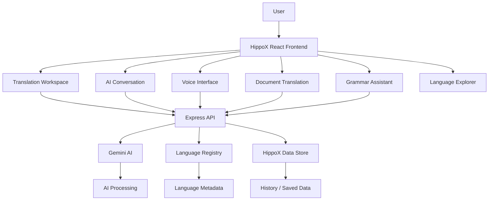

# 🦛 HippoX

### 🌍 Universal Multilingual Translation & AI Conversation Platform

> **Translate. Understand. Speak. Connect. — Across Languages.**

HippoX is a modern multilingual AI platform designed to bring **translation, language discovery, voice interaction, document translation, grammar assistance, and conversational language workflows** into one unified application.

Built with a modern **React + TypeScript + Vite** frontend and **Node.js + Express + Gemini AI** backend, HippoX is designed as a foundation for a production-grade multilingual communication platform.

**Project Status:** 🚧 Active Development

---

## 🚀 Live Demo

> https://hippox.ai.studio

**[🌐 Launch HippoX](https://hippox.ai.studio)**

---

## ✨ Core Features

### 🌍 Multilingual Translation

- Text-to-text translation
- Language selection and discovery
- Language search by:
  - Language name
  - Native name
  - ISO code
  - Script
- Large language registry
- Translation confidence information
- Translation history
- Saved translations

### 🤖 AI Conversation

HippoX includes an AI-powered conversational workflow designed for multilingual communication.

The intended workflow:

```text
Speaker 1
   ↓
Speech / Text
   ↓
Language Recognition
   ↓
AI Understanding
   ↓
Translation / Response Generation
   ↓
Target Language
   ↓
Speaker 2
```

The system is designed to support conversations where participants communicate using different languages.

### 🎙️ Voice Interaction

- Browser speech recognition
- Speech-to-text workflow
- Text-to-speech playback
- Voice conversation interface
- Language-aware speech processing

### 📄 Document Translation

Designed for multilingual document workflows including:

- Document upload
- Text extraction
- Translation
- Translated document generation

### 📝 Grammar Assistant

AI-powered grammar functionality for:

- Grammar checking
- Corrections
- Suggestions
- Practice workflows

### 🔎 Language Discovery

Explore supported languages through an interactive language registry with searchable language metadata.

### 📊 Analytics

The application includes an analytics interface for tracking translation and language-related activity.

### 🔐 User & API Features

- Authentication foundation
- User profile
- API key management
- Saved translations
- Translation history
- Application settings

---

# 🏗️ Architecture



---

# 🧠 AI Architecture

HippoX uses a backend AI layer to handle intelligent language workflows.

```text
User Input
     │
     ▼
Language Processing
     │
     ├── Language Detection
     ├── Translation
     ├── Grammar Analysis
     └── Conversation Processing
     │
     ▼
Gemini AI
     │
     ▼
Structured API Response
     │
     ▼
React UI
```

---

# 🛠️ Tech Stack

## Frontend

| Technology | Purpose |
|---|---|
| React | UI framework |
| TypeScript | Type safety |
| Vite | Development/build tooling |
| React DOM | Browser rendering |
| Lucide React | Icons |
| Motion | UI animations |
| Tailwind CSS | Styling |

## Backend

| Technology | Purpose |
|---|---|
| Node.js | Runtime |
| Express | REST API |
| TypeScript | Backend development |
| Gemini API | AI processing |
| dotenv | Environment configuration |

## Development

```text
VS Code
Git
GitHub
npm
Vite
TypeScript
```

---

# 📁 Project Structure

```text
HippoX-main/
│
├── data/
│   └── hippox_db.json
│
├── public/
│   └── assets/
│
├── server/
│   └── store.ts
│
├── src/
│   ├── components/
│   │   ├── CommandSearchModal.tsx
│   │   ├── HippoMascot.tsx
│   │   ├── LanguageSelectorModal.tsx
│   │   ├── Sidebar.tsx
│   │   ├── TopNav.tsx
│   │   └── TranslationWorkspace.tsx
│   │
│   ├── data/
│   │   └── languageRegistry.ts
│   │
│   ├── utils/
│   │   └── audioPlayer.ts
│   │
│   ├── views/
│   │   ├── AnalyticsView.tsx
│   │   ├── ApiView.tsx
│   │   ├── ConversationView.tsx
│   │   ├── DocumentsView.tsx
│   │   ├── GrammarView.tsx
│   │   ├── HistoryView.tsx
│   │   ├── HomeView.tsx
│   │   ├── LanguagesView.tsx
│   │   ├── PricingView.tsx
│   │   ├── ProfileView.tsx
│   │   ├── SavedView.tsx
│   │   ├── SettingsView.tsx
│   │   └── VoiceView.tsx
│   │
│   ├── App.tsx
│   ├── index.css
│   ├── main.tsx
│   └── types.ts
│
├── .env.example
├── .gitignore
├── index.html
├── metadata.json
├── package.json
├── server.ts
└── README.md
```

---

# ⚡ Getting Started

## 1. Clone the repository

```bash
git clone YOUR_GITHUB_REPOSITORY_URL
cd HippoX-main
```

## 2. Install dependencies

```bash
npm install
```

## 3. Configure environment variables

Create a `.env` file in the project root:

```env
GEMINI_API_KEY=your_gemini_api_key_here
```

Your project structure should look like:

```text
HippoX-main/
├── .env
├── .env.example
├── package.json
├── server.ts
└── src/
```

### ⚠️ Security

Never commit your real `.env` file or API key to GitHub.

The project `.gitignore` is configured to exclude environment files while keeping `.env.example`.

---

# ▶️ Run Locally

Start the development server:

```bash
npm run dev
```

Then open:

```text
http://localhost:3000
```

---

# 🏭 Production Build

Build the frontend and backend:

```bash
npm run build
```

Start the production server:

```bash
npm start
```

---

# 🧪 Type Checking

Run TypeScript validation:

```bash
npm run lint
```

---

# 🔌 API Reference

HippoX exposes a REST API under:

```text
/api/v1
```

## Health

```http
GET /api/v1/health
```

## Languages

```http
GET /api/v1/languages
```

```http
GET /api/v1/languages/:code
```

## Language Detection

```http
POST /api/v1/detect-language
```

## Translation

```http
POST /api/v1/translate
```

## Grammar

```http
POST /api/v1/grammar/check
```

```http
POST /api/v1/grammar/practice
```

## Conversation

```http
POST /api/v1/conversation
```

## Document Translation

```http
POST /api/v1/documents/translate
```

## Speech Synthesis

```http
POST /api/v1/synthesize
```

## Transcription

```http
POST /api/v1/transcribe
```

## OCR

```http
POST /api/v1/ocr
```

## History

```http
GET /api/v1/history
```

## Saved Content

```http
GET /api/v1/saved
```

---

# 🎙️ Voice Processing

The voice workflow is designed around browser-native speech capabilities and backend AI processing.

```text
Microphone
    ↓
Speech Recognition
    ↓
Text
    ↓
AI Language Processing
    ↓
Translation / Response
    ↓
Text-to-Speech
    ↓
Audio Output
```

Browser support for speech recognition and synthesis can vary depending on the browser and operating system.

---

# 🌐 Language Ecosystem

HippoX includes a dedicated language registry containing language metadata used by the application's language-selection and discovery interfaces.

Language information can include:

- Language name
- Native name
- ISO identifiers
- Scripts
- Regional information
- Capability metadata
- Translation availability
- Speech-related metadata

> Language coverage and individual AI capabilities depend on the underlying model and service integrations.

---

# 💾 Data & Storage

The project currently includes a lightweight application data store for development purposes.

```text
data/
└── hippox_db.json
```

The architecture can later be extended to production databases such as:

- PostgreSQL
- MySQL
- MongoDB
- Cloud-managed databases

---

# 🔐 Security

Important security practices:

- Never expose API keys in frontend code.
- Store secrets in environment variables.
- Never commit `.env` to Git.
- Validate API requests on the backend.
- Keep AI credentials server-side.
- Apply authentication and authorization before exposing protected production endpoints.
- Add rate limiting before production deployment.
- Validate uploaded documents and media.
- Restrict file sizes and accepted MIME types.
- Sanitize user-generated content where appropriate.

---

# 📸 Screenshots

Add application screenshots here when publishing the project:

```text
docs/
├── home.png
├── translation.png
├── conversation.png
├── languages.png
└── voice.png
```

Example:

```markdown

```

---

# 🚧 Development Status

HippoX is currently under active development.

### Completed / Available Foundation

- [x] React + TypeScript frontend
- [x] Vite development environment
- [x] Express backend
- [x] Gemini API integration foundation
- [x] Translation API
- [x] Language detection API
- [x] Grammar API foundation
- [x] Conversation API foundation
- [x] Speech synthesis endpoint
- [x] Transcription endpoint
- [x] OCR endpoint
- [x] Language registry
- [x] Translation history
- [x] Saved content
- [x] Analytics interface
- [x] Settings interface
- [x] API management interface

### 🚀 In Progress

- [ ] Advanced real-time multilingual conversation
- [ ] Improved speech recognition language mapping
- [ ] Natural conversational AI responses
- [ ] More robust language capability detection
- [ ] Production-grade authentication
- [ ] Persistent production database
- [ ] Advanced document processing
- [ ] Improved voice pipeline
- [ ] Production deployment optimization

---

# 🗺️ Roadmap

## Phase 1 — Foundation

- [x] Core UI
- [x] Translation workflow
- [x] Language registry
- [x] Backend API
- [x] AI integration foundation

## Phase 2 — Intelligence

- [ ] Advanced conversational AI
- [ ] Context-aware conversations
- [ ] Better language detection
- [ ] Improved translation quality
- [ ] Conversation memory
- [ ] Multi-turn dialogue handling

## Phase 3 — Voice

- [ ] Real-time speech pipeline
- [ ] Improved multilingual speech recognition
- [ ] Natural AI voice responses
- [ ] Speaker-aware conversations
- [ ] Low-latency audio processing

## Phase 4 — Documents

- [ ] PDF translation
- [ ] DOCX translation
- [ ] Image translation
- [ ] OCR improvements
- [ ] Formatted translated document export

## Phase 5 — Production

- [ ] Production database
- [ ] Secure authentication
- [ ] Rate limiting
- [ ] Monitoring
- [ ] Error tracking
- [ ] Scalable deployment
- [ ] API versioning
- [ ] Automated testing

---

# 🤝 Contributing

Contributions are welcome.

### Basic workflow

```bash
git checkout -b feature/your-feature
```

Make your changes, test them locally, and commit:

```bash
git add .
git commit -m "feat: add your feature"
git push origin feature/your-feature
```

Then open a Pull Request.

---

# 📜 License

A final open-source license has not yet been selected.

If this project is intended to be open source, consider adding an appropriate license such as MIT, Apache-2.0, or another license that matches the project's requirements.

---

# 🔗 Project Links

### 🌐 Live Application

**[🚀 Open HippoX](PASTE_YOUR_PUBLISHED_HIPPOX_URL_HERE)**

### 💻 GitHub Repository

**[⭐ View Source Code](PASTE_YOUR_GITHUB_REPOSITORY_URL_HERE)**

---

# 🦛 About HippoX

HippoX aims to make multilingual communication simpler by combining **translation, conversation, voice, documents, grammar, and language discovery** into one unified AI platform.

The long-term vision is to build a language technology platform where people can communicate naturally regardless of the language they speak.

> **One platform. Many languages. One conversation.**

---

<div align="center">

### 🦛 HippoX

**Universal Multilingual Translation & AI Conversation Platform**

Built with ❤️ using React, TypeScript, Node.js, Express & Gemini AI.

**🚧 Active Development**

</div>
